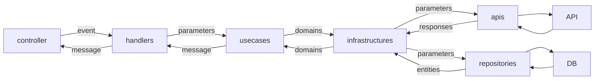

# line-gpts

## Env

### Local

```bash
cp .dev.vars.example .dev.vars
```

### Production
```bash
wrangler secret put LINE_CHANNEL_ACCESS_TOKEN
wrangler secret put OPENAI_API_KEY
```

## Install

```bash
npm i
```

## Local

```bash
make local
```

## Deploy

```bash
make deploy
```

## Architecture


